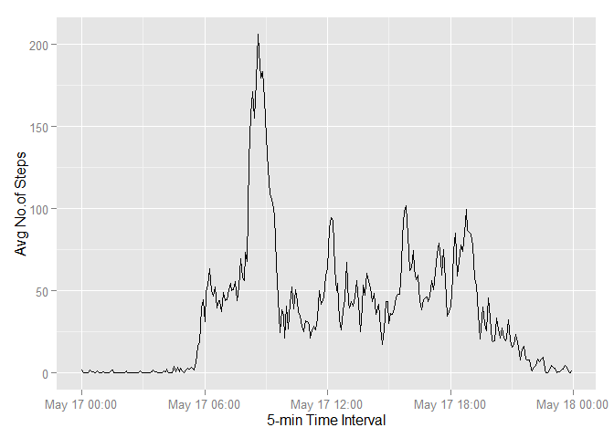
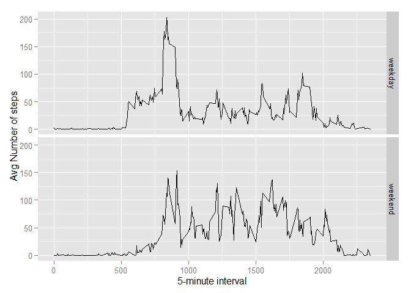

# Reproducible Research: Peer Assessment 1


## Loading and preprocessing the data

Check if the data file (.zip and .csv) already exists or not, if does not exist , download the file and unzip
Read the data i.e (load to a R data frame)


```r
fileurl <- "https://d396qusza40orc.cloudfront.net/repdata%2Fdata%2Factivity.zip"

zip_stat <- file.exists("activity.zip")
if (!zip_stat) download.file(url1,destfile="activity.zip")

file_stat <- file.exists("activity.csv")
if (!file_stat) unzip("activity.zip",files = NULL, list=FALSE,overwrite= TRUE, 
                      junkpaths = FALSE, exdir=".")

activity <- read.csv("activity.csv",header= TRUE,sep =",")
```

Transform the date to date format


```r
activity$date <- as.Date(activity$date)
```


## What is mean total number of steps taken per day?

Calculate the total no.of steps taken per day and do histogram
Excluded the NAs for this part of the assignment, as NAs do mean there is no data avaialable 
Looked at the days for which the data is missing or NAs it is been missing for the whole days


```r
require(dplyr)
activity_complete <- activity[!is.na(activity$steps),]

by_date <- activity_complete %>% group_by(date)
activity_day <- by_date %>% summarise_each(funs(sum), steps)

hist(activity_day$steps, 
     main="Histogram for Total no.of steps taken each day", 
     xlab="Total No.of steps", 
     border="blue", 
     col="green")
```

 

Calculate mean and median of total no.of steps per day

```r
totalmean <- as.numeric(mean(activity_day$steps))
totalmedian <- median(activity_day$steps)
```

Mean total number of steps taken per day are 1.0766189\times 10^{4}

Median total number of steps taken per day are 10765


## What is the average daily activity pattern?


```r
require(ggplot2)
library(ggplot2)
avg_act <- aggregate(activity$steps, FUN = mean, by = list(activity$interval), na.rm = TRUE)
colnames(avg_act) <- c("Interval", "AvgSteps")
avg_act1 <- avg_act
avg_act$Interval <- as.character(avg_act$Interval,length=4)
avg_act$Interval<-formatC(avg_act$Interval,drop0trailing=FALSE,preserve.width='4')
avg_act$Interval<-gsub(' ',0,avg_act$Interval)
avg_act$Interval<-paste(avg_act$Interval,':00',sep="")
avg_act$Interval<-paste(substr(avg_act$Interval,1,2),':',substr(avg_act$Interval,3,7),sep="")
avg_act$Interval<-as.POSIXct(avg_act$Interval,format="%H:%M:%S")

qplot(avg_act$Interval, avg_act$AvgSteps, geom = "line", 
      xlab= "5-min Time Interval", ylab= "Avg No.of Steps")
```

 

Calculate the 5-min interval with max avg no.of steps across all days

```r
max_int <- avg_act$Interval[which(avg_act$AvgSteps == max(avg_act$AvgSteps))]
max_int <- as.character(max_int)
max_int <- substr(max_int,12,16)
```

5-Minute Interval that contains  maximum number of steps 08:35

## Imputing missing values


```r
activity_missing <- activity[is.na(activity$steps),]
count1 <- count(activity_missing)
count1 <- count1[[1]]
```

Total number of missing values in the dataset 2304

fill the missing values with the mean value for the same 5-minute interval

```r
complete <- activity
filled <- 1:length(activity$steps)
for (i in length(filled)) {
  if (!is.na(activity$steps[i])) 
    filled <- c(activity$steps[i])
      else filled <- (avg_act1[avg_act1$Interval == activity$interval[i], "AvgSteps"])
}
complete$steps[is.na(complete$steps)] <- filled[!is.na(filled)]
```

Calculate the Total no.of steps per day, with missing values filled in

```r
by_date <- complete %>% group_by(date)
complete_day <- by_date %>% summarise_each(funs(sum), steps)

hist(complete_day$steps, 
     main="Histogram for Total no.of steps taken each day", 
     xlab="Total No.of steps", 
     border="blue", 
     col="green")
```

 


Calculate mean and median of total no.of steps per day with missing values filled in

```r
totalmeanc <- as.numeric(mean(complete_day$steps))
totalmedianc <- median(complete_day$steps)
```

Mean total number of steps taken per day are 9394.8506032

Median total number of steps taken per day are 1.0395\times 10^{4}

## Are there differences in activity patterns between weekdays and weekends?


```r
complete$date <- as.POSIXct(complete$date)
day.sep <- function(date) {
  day <- weekdays(date)
  if (day %in% c("Monday", "Tuesday", "Wednesday", "Thursday", "Friday")) 
    return("weekday") else if (day %in% c("Saturday", "Sunday")) 
      return("weekend") else stop(NA)
}
complete$day <- sapply(complete$date, FUN = day.sep)

averages <- aggregate(steps ~ interval + day, data = complete, mean)
ggplot(averages, aes(interval, steps)) + geom_line() + facet_grid(day ~ .) + 
  xlab("5-minute interval") + ylab("Avg Number of steps")
```

 


